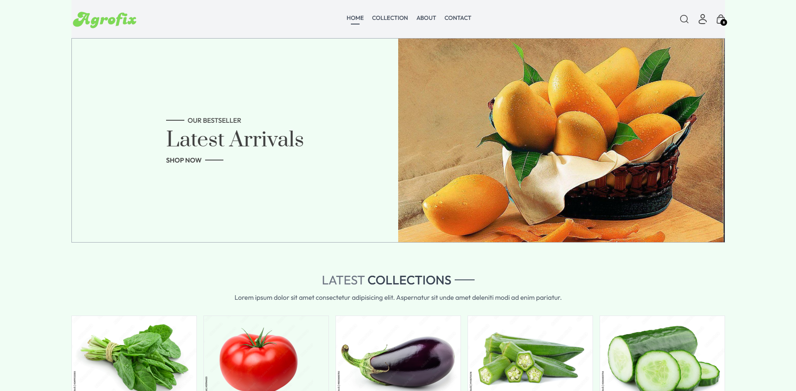
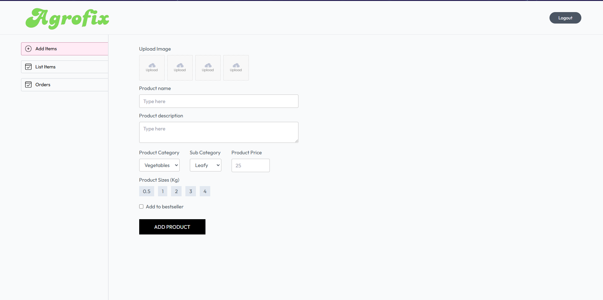
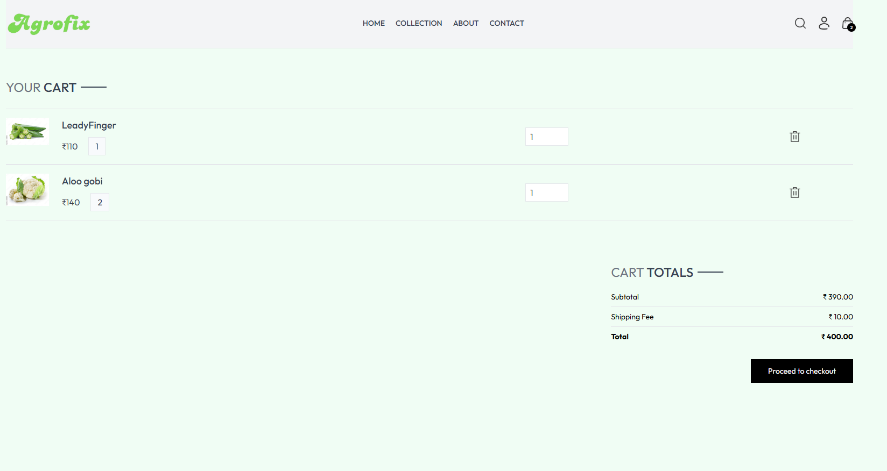

# AgroFix - Fruits and Vegetables Brand E-commerce Website

Elevate your fashion with **AgroFix** – your go-to online store for high-quality, fruits and vegetables. This project is a fully functional e-commerce website built using the **MERN stack** (MongoDB, Express.js, React.js, Node.js), designed to provide an intuitive and seamless shopping experience.

## Features

✨ **Modern and Responsive Design**  
✨ **Dynamic Product Listings**  
✨ **Interactive Cart System**  
✨ **User Authentication**  
✨ **Payment Integration (Future)**  
✨ **Product Filtering & Sorting**  
✨ **Admin Panel for Product Management**  
✨ **User-Friendly UI/UX**

### Deploy Links:

1. **Frontend Link:** (https://agrofix-one.vercel.app)
2. **Admin Panel Link:** (https://agrofix-admin.vercel.app)
3. **Backend Link:** (https://agrofix-backend.vercel.app)

## Tech Stack

- **Frontend:** React, Vite, Tailwind CSS, React Router, Redux
- **Backend:** Node.js, Express, MongoDB
- **Authentication:** JWT (JSON Web Tokens)
- **Deployment:** Vercel (Frontend), Heroku (Backend)

## Screenshots

## Getting Started

To get started with the development of **AgroFix**, follow the instructions below.

### Prerequisites

1. Install **Node.js** (Version 16 or later)
2. Install **npm** (Optional but recommended)
3. Install **express** (Creating backend)
4. Install **mongoose** (Database)
5. Install **axios** (Making HTTP request)
6. Install **react-router-dom** (Dynamic routing)

## API Used

### 1. **Product API**

- **Endpoint:** `/api/product/list`
- **Method:** `GET`
- **Description:** Fetches a list of all products available in the store.
- **Response:** Returns an array of products with details like name, price, description, and images.

### 2. **User Authentication API**

- **Endpoint:** `/api/auth/register`  
  **Method:** `POST`  
  **Description:** Registers a new user with provided details (username, email, password).  
  **Response:** Returns the user's registration status and JWT token.

- **Endpoint:** `/api/auth/login`  
  **Method:** `POST`  
  **Description:** Authenticates the user with email and password and returns a JWT token on successful login.

### 3. **Cart Management API**

- **Endpoint:** `/api/cart/add`
- **Method:** `POST`
- **Description:** Adds an item to the user's cart.
- **Response:** Returns the updated cart data.

- **Endpoint:** `/api/cart/update`
- **Method:** `PUT`
- **Description:** Updates the quantity of an item in the cart.
- **Response:** Returns the updated cart data.

### 4. **Order API**

- **Endpoint:** `/api/order/create`
- **Method:** `POST`
- **Description:** Creates a new order using the cart data.
- **Response:** Returns the order details after successful creation.

> **Note:** The APIs are designed to work with JWT authentication, and require a valid token for certain operations (such as adding to cart and placing orders).

## App Sections

The **AgroFix** website is organized into several key sections that help users navigate easily through the shopping experience.

### 1. **Home Page**

- **Features:**
  - Featured products carousel
  - Quick links to different product categories
  - User login/signup buttons
  - A footer with links to privacy policy, terms of service, etc.

### 2. **Product Listing Page**

- **Features:**
  - Displays all available products with filtering and sorting options (by price, category, and size).
  - Users can click on each product to view more details on the product page.

### 3. **Product Details Page**

- **Features:**
  - Displays detailed information about a product, including size options and price.
  - Users can add the product to the cart, choosing a size before doing so.

### 4. **Cart Page**

- **Features:**
  - Displays all products added to the cart.
  - Users can update the quantity or remove items.
  - Shows the total amount and delivery fee.
  - Allows users to proceed to checkout.

### 5. **Checkout Page**

- **Features:**
  - Collects the user’s shipping information.
  - Displays a summary of the order (products, shipping details, total cost).
  - Placeholder for future payment gateway integration (e.g., Stripe, PayPal).

### 6. **Admin Panel (Future)**

- **Features:**
  - Allows administrators to manage products (add, edit, delete).
  - View orders placed by users.
  - Edit or manage product categories.
